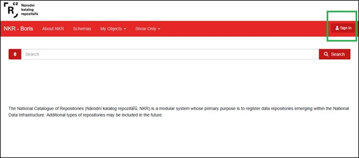
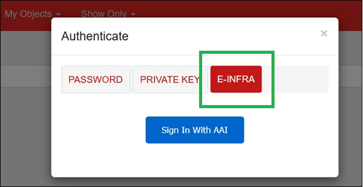
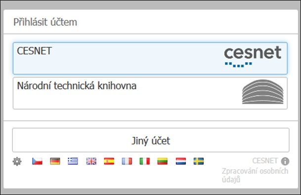
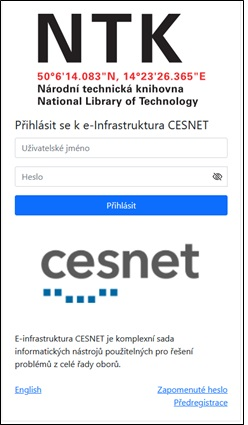
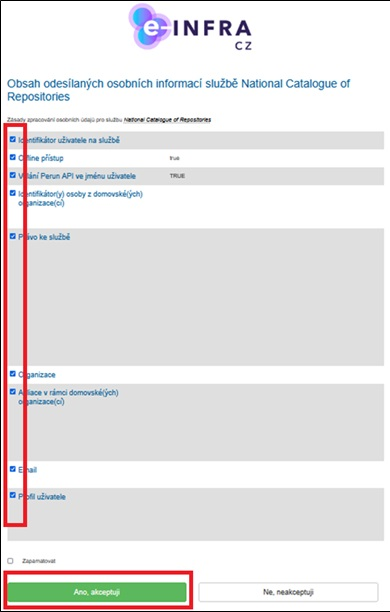
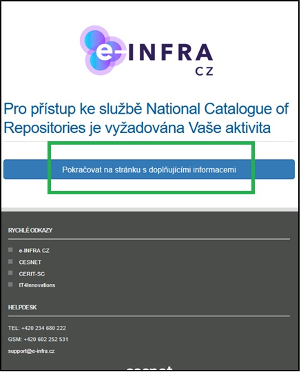
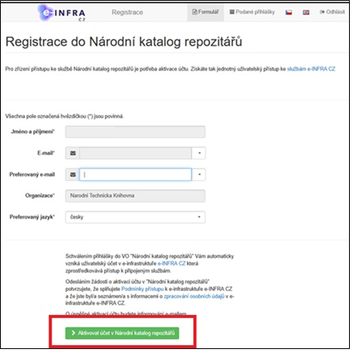
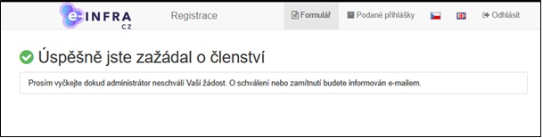
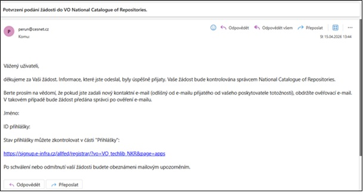
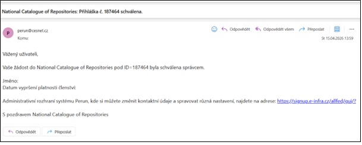

# Login
## How to log in

You can find the [NKR](https://repo.cz) here. To log in to the system, click the Sign In icon in the upper-right corner. 

A window with login options will open; select E-INFRA and click Sign In With AAI. 

A dropdown menu will appear from which you can select your institution. If your institution is not listed in the E-INFRA menu, please contact your institution.  

To log in, use your institutional credentials. 

## Possible login scenarios

There are two possible scenarios after the first login.

### Pre-approved email address

**Your email address has been pre-approved.** In this case, when you log in for the first time, the system will ask whether you agree to have the provided information transferred from E-INFRA to the NKR system. We recommend leaving all the preselected options checked. Of course, you have the right to select only the options you choose; however, if you do so, we cannot guarantee that you will be able to log in to the NKR. If you click **Yes, I accept** at the bottom of the page, the system will log you in, and the prompt will not appear again next time. You are now logged in and can use the NKR with more features than a guest user. 

### Email address not pre-approved

**Your email address has not been pre-approved.** In this case, the system will prompt you to activate your account. All fields will be pre-filled. Please click through all of them. 

You will then see a confirmation that your membership application has been successfully submitted. Your application will be forwarded to the NKR administrator, who will approve it within a few hours. 

You will also receive an e-mail with the same information.  

Once your request has been approved, you will receive another e-mail notification.  

You can now log in to NKR the same way as before. Click the Sign In icon in the upper-right corner. A window will open with login options; select E-INFRA and confirm by clicking Sign In With AAI.  

To log in, use your institutional credentials. 

When you log in for the first time, the system will ask whether you agree to have the provided information transferred from E-INFRA to the NKR system. We recommend leaving all the preselected options checked. Of course, you have the right to select only the options you choose; however, if you do so, we cannot guarantee that you will be able to log in to the NKR. If you click **Yes, I accept** at the bottom of the page, the system will log you in, and the prompt will not appear again next time. You are now logged in and can use the NKR with more features than a guest user. 

A dropdown menu will appear from which you can select your institution. 

