# Menu

After logging in, you will see the following options on the home page; some of them are described in more detail below.

1.	**Create** - Here you will find a drop-down menu with options for creating a new record (for example, if you want to create a new organization). The options vary depending on the role and permissions assigned to you. 
2.	**About NKR** - General information about the NKR.
3.	**Schemas** - Here you will find an overview of all digital object schemas used in the NKR (note: for viewing only; you cannot add a new record from this section).
4.	**My Objects** – Here you will find records stored in the NKR. The menu is divided into an overview of all records and those that you are authorized to edit.
5.	**Show Only** – Here you will find a list of all records contained in the NKR, organized by digital object type. You can view these records, and if you have editing rights, you can also edit them.
6.	**Search** – You can search using keywords; click the two arrows on the left to view the advanced search options.

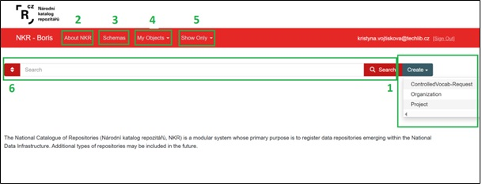

## Create
Here you will find a drop-down menu with options for creating a new record (e.g., if you want to create a new request for a controlled vocabulary). The options vary depending on the role/permissions assigned to you. After selecting an option from the dropdown menu, a new form will open to fill out. Required fields are marked with an asterisk; then save by clicking the **Save** icon.

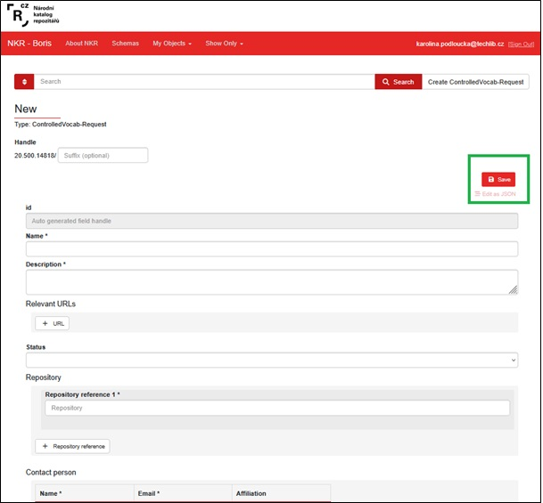

## Schemas
This icon takes you to a page stating that the schemas for all digital objects contained in the NKR are available at https://repo.cz/#schemas. Clicking on the link will open the page in a new browser tab.

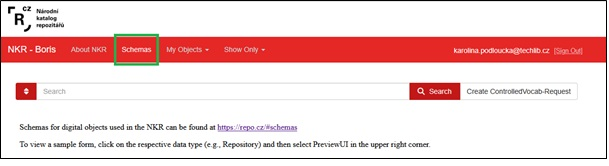

A list of all types of digital objects is displayed here. A digital object refers to structured content and metadata that convey specific information. This section is for viewing only; you cannot edit any objects or create new records. Each schema is displayed in JSON format and in a form. 

**ContactList** – List of contacts

**ControlledVocab** – Controlled vocabularies

**ControlledVocab-Request** – Request for a new controlled vocabulary

**Group** – Not used 

**MetadataSchema** – Description of the metadata schema used in this repository (to be updated)

**Organization** – Information about the organization associated with the repository

**Project** – Project/grant linked to a repository

**Repository** – Repository description

**Test** – Please do not use

**User** – Please do not use

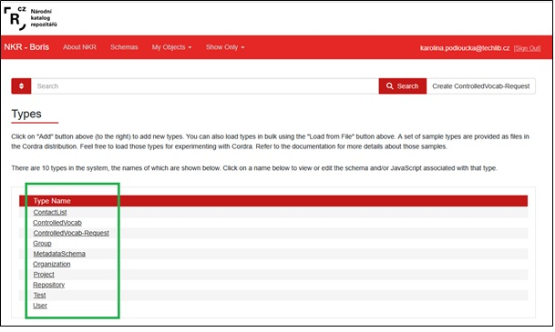

For example, if you want to view a schema for an organization, clicking Organization displays it in JSON format.

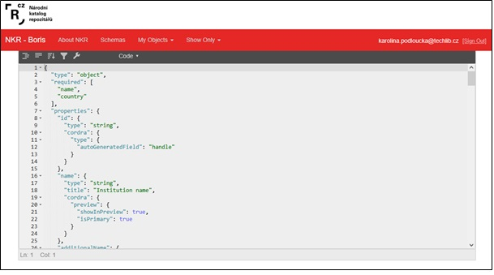

If you click the icon above **Preview UI**, the organization form will be displayed. 

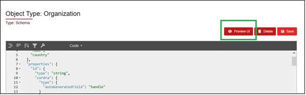

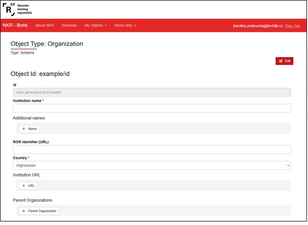

## My Objects 
In this tab, you have the following options: **All Objects and My Editable**.

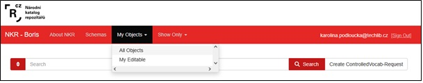

### All Objects 
Here you find all records in the NKR in one place.

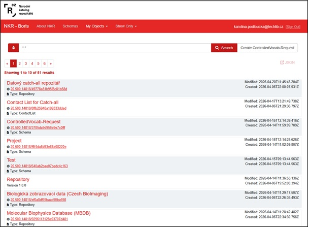

Clicking on a record's name or ID takes you to its details page, where you'll see an **Edit** button if you have editing permissions for that record.

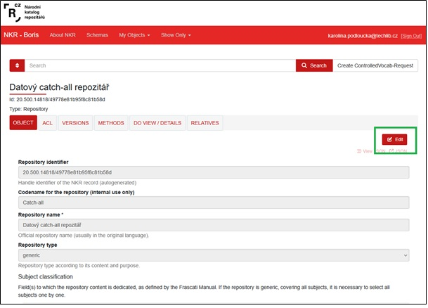

### My Editable
Here you will find only those records that you have permission to edit. After clicking the **Edit** button, you can edit all fields, then save your changes by clicking the **Save** button.

## Show Only
Here you will find all records organized into individual digital objects. This feature makes it easy to search through records in each section.

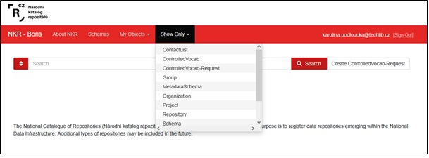

For example, if you click on **Repository**, a list of all repositories stored in the NKR will appear.

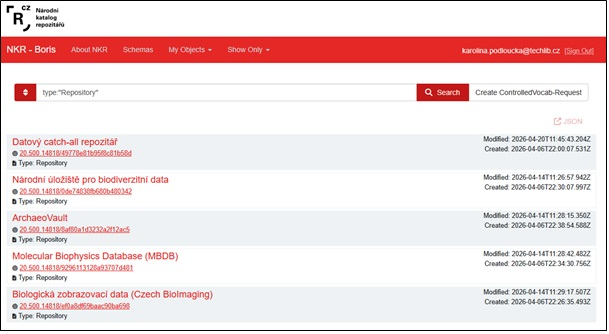

Clicking on a record's name or ID takes you to its details page, where you'll see an **Edit** button if you have editing permissions for that record.

